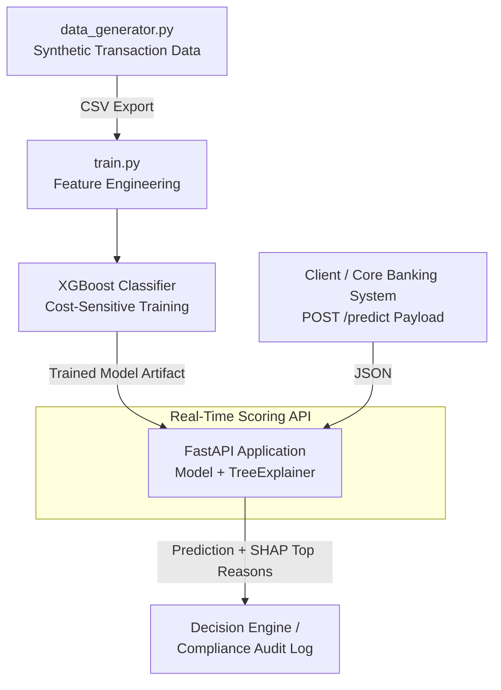

# 🛡️ Real-Time APP Fraud Detection System


## 🏢 Business Problem

Authorised Push Payment (APP) fraud is a severe and growing threat in the UK financial sector, where criminals manipulate victims into authorizing payments to accounts controlled by the fraudster. Under the UK Payment Systems Regulator's (PSR) new reimbursement requirements, sending payment service providers (PSPs) and receiving PSPs are now liable to reimburse victims of APP fraud. This fundamentally shifts the financial burden onto banks and fintechs.

To mitigate multi-million-pound liabilities and comply with stringent Financial Conduct Authority (FCA) regulations, financial institutions require **real-time, low-latency transaction monitoring pipelines**. Crucially, it is no longer sufficient to just block a transaction; institutions must provide **Explainable AI (XAI)** to justify *why* a transaction was interventions, ensuring transparent and unbiased decision-making for regulatory audits.

This project demonstrates a production-grade machine learning pipeline that not only accurately detects complex APP fraud patterns in real-time but also leverages SHAP (SHapley Additive exPlanations) to provide instant, human-readable rationales for every blocked transaction.

## 🏗️ Architecture



## 🛠️ Tech Stack

*   **XGBoost:** Chosen for its industry-leading performance on tabular data and incredibly fast inference times, which is critical for the <50ms latency SLAs required in real-time core banking payment flows. Cost-sensitive learning (`scale_pos_weight`) handles the extreme reality of class imbalance in fraud detection.
*   **FastAPI:** Provides a high-performance, async-native web framework to serve the model. It offers automatic OpenAPI documentation and strict Pydantic data validation to prevent malformed payloads from crashing the inference engine.
*   **SHAP (SHapley Additive exPlanations):** Essential for FCA compliance. `TreeExplainer` is heavily optimized for XGBoost, allowing us to calculate feature contributions on-the-fly without breaking latency budgets.
*   **Faker & Pandas:** Used to engineer a robust, synthetic dataset that accurately mimics UK banking transactions and injects complex APP fraud typologies (e.g., late-night high-value transfers to new payees).
*   **Locust:** Integrated for extreme stress-testing to validate API latency and throughput SLAs under heavy simulated concurrent load.
*   **Docker:** Ensures the inference API is environment-agnostic, scalable, and ready to be deployed to Kubernetes or serverless container platforms.

## 🚀 Quickstart Guide

### 1. Clone the Repository
```bash
git clone https://github.com/rishisubedi/app-fraud-detection.git
cd app-fraud-detection
```

### 2. Generate Data & Train the Model Locally
It is recommended to run this within a virtual environment.
```bash
python -m venv venv
source venv/bin/activate  # On Windows: venv\Scripts\activate
pip install -r requirements.txt

# Generate synthetic transaction data (creates data/transactions.csv)
python src/data_generator.py

# Train the XGBoost model (creates models/xgb_fraud_model.json)
python src/train.py
```

### 3. Run the API (via Docker)
```bash
# Build the Docker image
docker build -t app-fraud-api .

# Run the container (maps port 8000)
# Note: We mount the models local directory to the container so it can load the trained artifact
docker run -p 8000:8000 -v $(pwd)/models:/app/models app-fraud-api
```
*(Alternatively, run locally without Docker: `uvicorn src.api:app --host 0.0.0.0 --port 8000 --reload`)*

## 📡 API Usage

Once the API is running, you can test the real-time scoring endpoint.

### Sample Request (Simulating a High-Risk Transaction)
```bash
curl -X POST "http://localhost:8000/predict" \
     -H "Content-Type: application/json" \
     -d '{
           "transaction_id": "req_59382",
           "account_id": "48291",
           "receiver_account_id": "99382",
           "amount_gbp": 4500.00,
           "is_new_payee": true,
           "device_risk_score": 92.5
         }'
```

### Expected Response
Notice how the `top_reasons` dynamically explain that the high device risk and being a new payee triggered the block.

```json
{
  "transaction_id": "req_59382",
  "fraud_probability_score": 0.982181,
  "block_transaction": true,
  "top_reasons": {
    "amount_gbp": 2.674,
    "is_new_payee": 0.712,
    "device_risk_score": 0.623
  }
}
```

## 📊 Performance Testing

A critical requirement for real-time banking pipelines is responding within tight SLAs (typically < 50ms) to ensure the payment flow is not interrupted. We validate this using `locustfile.py`.

**To execute the load test locally:**
```bash
python -m locust -f locustfile.py --headless -u 50 -r 10 --run-time 15s --host http://localhost:8000
```

### Expected Load Performance
Under aggressive local stress-testing simulating **50 concurrent users** generating dynamic, randomized payloads continuously:
*   **Zero Failures:** The API maintains a 0% failure rate, successfully computing XGBoost predicts and `TreeExplainer` SHAP values concurrently.
*   **Latency SLAs Met:** Average response times remain single-digit milliseconds (e.g., ~5ms - 15ms), well within the stringent < 50ms requirement for core banking APIs.

## 🔮 Future Improvements & Scale roadmap

While this project demonstrates a highly robust foundational architecture, scaling this to a true Tier-1 FinTech production environment would involve the following enhancements:

1.  **Feature Store Integration (e.g., Redis/Feast):** Currently, features like `device_risk_score` are passed directly in the payload. In reality, the API would extract real-time streaming features (e.g., "count of transactions in the last 10 minutes") from a low-latency NoSQL feature store.
2.  **Streaming Aggregations (Kafka/Flink):** Upgrading from static batch feature generation to robust event-driven stream processing using Apache Flink to calculate velocity rules and graph-based features incrementally.
3.  **Graph Neural Networks (GNNs):** Fraud rings are highly interconnected. Adding a GNN (e.g., using DGL or PyG) alongside XGBoost would allow the model to catch money mule networks by analyzing the *relationships* between sending and receiving accounts before the money moves.
4.  **Shadow Deployment & A/B Testing:** Implementing routing logic (via a mesh like Istio or Envoy) to deploy new model versions in "shadow mode" to evaluate prediction drift and business metrics safely before promoting to blocking mode.
